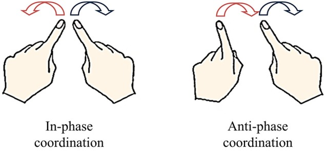
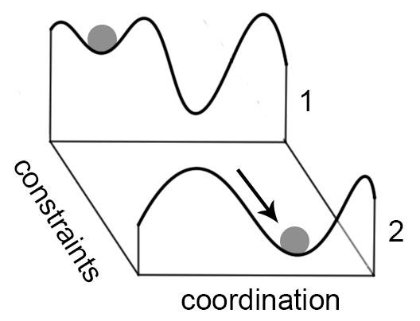

In this article, we will be focusing on two key concepts of ecological-dynamics: self-organisation, and the attractor landscape.

As we have [shown previously](/blog/the-dynamical-systems-approach), ecological-dynamics understands our bodies as complex systems with numerous interacting parts (or degrees of freedom). Self-organisation means that the parts of the system have a tendency to adjust and adapt to each other^[Davids K., Button Chris et Bennett Simon, _Dynamics of skill acquisition: a constraints-led approach_, Champaign, IL, Human Kinetics, 2008.], creating patterns without the need for a hierarchical system of control, like the brain controlling every single part of our body. Order therefore is emergent, and does not require the micromanagement of all degrees of freedom.

Because of these spontaneous tendencies and patterns, our behavior will be “attracted” to certain forms of organisation, which we will therefore call _attractors_. The best way to understand it is to imagine a ball rolling on a landscape: if it starts on a slope, it will be unstable, and will roll down until it finds a stable place at the bottom of a valley^[For a really intuitive introduction to attractor landscapes, please see [https://ncase.me/attractors/](https://ncase.me/attractors/]). If we model our behaviour this way, we end up with a landscape of attractors, the most stable behaviours being at the bottom of the valleys, and the less stable at the top of the hills. We will first examine how attractor landscapes are used to create models of behaviour, without going into the mathematical details. Then we will show how a more metaphorical use of attractors fits coaching and teaching practical purposes.

## **Finger wiggling as a case of self-organization**

Let’s begin with the classic example studied by Kelso et al.^[Kelso J. A., Holt K. G., Rubin P. _et al._, « Patterns of human interlimb coordination emerge from the properties of non-linear, limit cycle oscillatory processes: theory and data », _Journal of Motor Behavior_ 13 (4), 1981, pp. 226‑261.] Try wiggling your index fingers from left to right. You should see some patterns appearing, rather than your fingers moving independently from each other. The fingers probably make a simultaneous and identical movement (they move “in-phase”), or a simultaneous but opposed movement (“anti-phase”). These are what we call motor synergies: coordinated and invariant relationships between different parts of our bodies, based on co-variation. When I slow down my movement, both fingers slow down, they act as a single unit, maintaining this relationship. So we have an intention of movement, in this example wiggling our fingers, and then some kind of self-organisation of movement happens. The components of our bodies have self-organizing tendencies, which means we don’t need to micromanage everything, we don’t need to control every tiny degree of freedom.

This should help to understand that there are [constraints](/blog/brief-introduction-to-the-constraints-led-approach) on coordination, which make certain patterns of movement more available, probable or stable than others. In this case the contstraints are neuro-anatomical, because of the way our hand muscles and our nervous system are organized. In other words, the constraints shape which behaviours are (un)stable. The stable and functional patterns of organisation are called “attractors”, and they appear as being preferential, spontaneous, easier to control or in other words: “natural”. The unstable patterns are called “repellers”. In the Kelso et al. study, there were two attractors: in-phase and anti-phase. The degrees of liberty are reduced, the fingers don’t move independently, but are coordinated and have an invariant relationship.

We now have the elements to build our attractor landscape: there are two valleys, one for anti-phase, and one for in-phase. Our coordination ball will roll to the bottom of one of them. Between them are the repeller mountains formed by the less stable patterns.

Let’s add a layer to our finger wiggling example. If I start in phase, and then speed up my movements, I’ll stay in phase. It is the most stable coordination pattern, probably because homologous muscles are activated at the same time, facilitating control. But if I begin moving in anti-phase, and I speed up, at some point the movement becomes difficult to control and will brutally and involuntarily change to in-phase. This change from one attractor to the next is called a phase “shift” or transition. The fact that non-homologous muscles (adductors of the left hand and abductors of the right hand) have to contract at the same time renders control more difficult, and make the anti-phase pattern less stable. The increase in speed forces the organism to transition from one pattern to the other to solve the instability. A constraint change can lead to changes in the organisation in movement: when the constraint of speed is added, the pattern goes from anti-phase (1) to in-phase (2). Here, speed is what is called a control parameter: changing this parameter leads to changes in the organisation of movement.

In motor control research, these concepts are used to mathematically model our behaviour. They are a way of representing, not explaining what happens. We don’t have little attractors hidden somewhere, who decide what we do. But when we observe our behaviour, it does seem as if it was attracted in certain directions. On this blog, we will use the concept of attractors in this metaphoric and phenomenological way, rather than going into the mathematical details. It is a very useful concept for coaches and teachers, while only researchers will really benefit from all the complex mathematics behind it.

## **Can we apply this to more complex movements ?**

Let’s examine a real-world movement example, and see how we can use attractors metaphorically. Take the example of snowboard, which would also work with wakeboard, skateboard, etc. I ride goofy, with my right foot in front. From the start, it just felt more natural and comfortable that way. It was the most “attractive” solution, so let’s call that an “attractor”. And it just didn’t feel natural to ride regular (left foot in front), let’s call that a “repeller”. To visualize this, let’s imagine my coordination pattern is a ball rolling on a surface. The attractor (goofy) is a valley; the repeller (regular) is a mountain. This is an attractor landscape. The ball tends to roll from the mountain to the valley, the same way I’m attracted to one coordination pattern rather than the other.

Attractors are not established once and for all: they change when the internal and/or external constraints change. With practice, I became even more confident in the goofy position: the attractor is even deeper, and maybe wider than before. By contrast, it still feels weird, and even scary, to switch (put my left foot in front). Sure, I’m getting used to it. But as soon as I’m going fast, or if the slope steepens, or when I’m tired or scared, I revert to goofy. Maybe it’s even less stable because I became so confident on (I’m so attracted to) my normal side^[We have to note here that there might be some transfer from one side to the other: training on my good side probably helped me improve on my bad side too. But still, I don’t feel comfortable enough.]. It takes conscious effort to ride switch, constant attention to maintain it. And it feels like I’m fighting against my spontaneous tendencies, and that riding normally is just more functional and efficient, so why even bother ?

One important thing to note here, is that I can either ride normal, or switch; anything in between will be even less stable. The implication is that there will be non-linear changes in coordination. When I ride switch, a slight change in the environment might have a drastic effect on my movements, forcing me to suddenly shift from switch to normal, without going through all the intermediary solutions.

This effect of the environment, making certain behaviours more inviting than others, should make us think back to the concept of [affordances](/blog/affordances-perception-and-action). The environment offers and suggests certain action possibilities, like the handle of a coffee mug invites our grasp, especially if we had the intention of picking it up. We should therefore expect to see an attractor when an environment affords this specific behaviour, a repeller when it doesn’t. If the mug is boiling hot and the handle is visible, grasping the handle is attractive, but holding the mug directly in our palms, not so much.

## **Attractors: an essential conceptual tool for coaches**

I think this is useful for coaches in different ways. First, it helps understanding that learners have spontaneous tendencies, a pre-existing attractor landscape which depends on their past experiences and individual constraints. It seems to be a bit more explanatory than assuming that the spontaneous tendencies of learners all come from pre-existing knowledge. I only feel comfortable facing one way on a skateboard, but I don’t think it’s because there’s some knowledge I’m missing. As coaches, we need to take into account these spontaneous tendencies, maybe find out where they come from, and ask ourselves: is this something we want to fight against, or should we use them to our advantage ? In other words, are the skills we are training competing or cooperating with the spontaneous tendencies^[Zanone P. G. et Kelso J. A., « Evolution of behavioral attractors with learning: nonequilibrium phase transitions », _Journal of Experimental Psychology. Human Perception and Performance_ 18 (2), 1992, pp. 403‑421.] ?

Maybe the novice patterns we see are inefficient, dangerous, or simply we would like our learners to have a broader movement repertoire. Then we want to find ways to go against the learners pre-existing attractors. This seems to mean two things: we can make these novice patterns less attractive, and/or we can make the expert behaviours more attractive. And then the question becomes: to achieve this, what parameters or constraints can we change ? On my snowboard, it seems like if I’m going slow enough, or if I’m on a gentle slope, riding switch becomes a lot more attractive. We could also imagine temporarily changing the configuration of my bindings to make it less attractive to ride normally. In more general terms, this should invite teachers to think more carefully about the ways they design or choose their learning environments, in ways that create the right attractors and affordances. You want to see a specific behavior ? Design a learning situation that invites and makes this behaviour attractive.

Of course, the fact that there is some self-organization happening does not mean that we don’t have any choice in the way we move, or that our intentions or the instructions of a teacher have no effect. In a case where there are two or more attractors, the way we focus might help us shift from one pattern of movement to the next. In the same way, instructions can be thought of as (soft) constraints that can make inefficient patterns less attractive, or help us maintain unstable coordination patterns. There is the way you walk while going down the street thinking of your next meal, and there is the way you walk while doing your best to reenact the Monty Python’s silly walks. 

## **Conclusion**

Let’s sum up. We’ve seen that coordination and motor behaviour are, at least in part, self-organized. Because of different internal and external constraints, certain kinds of movements will be more attractive (stable, easy to control, natural, etc.) and some will be less so. The landscape of attractors metaphor is probably the best conceptual tool we have to make sense of these phenomena. It should give teachers and practitioners fresh perspectives on the way they teach and train.
